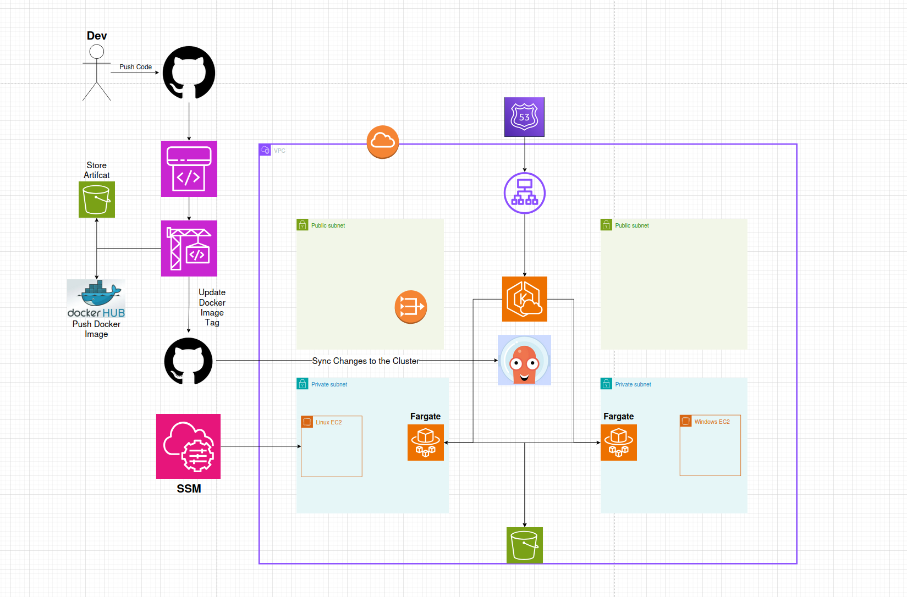
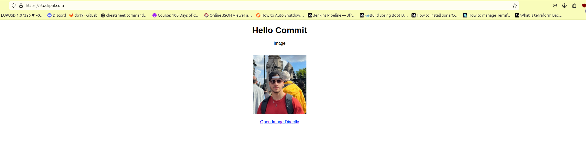

# AWS Lab
## Overview

### This project sets up a full AWS infrastructure, using Terraform, for a web application hosted on AWS using EKS (Elastic Kubernetes Service) and managed through ArgoCD. The setup includes:

* A VPC with both private and public subnets

* EC2 instances for managing the infrastructure

* A private S3 bucket for storing images

* An application deployed in a Kubernetes cluster (EKS) that serves random images via pre-signed URLs

* A CI/CD pipeline that updates the application whenever new code is pushed to the repository.



## Architecture
### Key Components:

1. VPC Setup:

    * A VPC with two private and two public subnets.

    * NAT Gateway for private subnets to access the internet.

    * Internet Gateway for public subnets to access the internet.

2. EC2 Instances:

    * Linux EC2: Deployed in a private subnet and used to connect to the Kubernetes cluster using kubectl.

    * Windows EC2: Deployed in a different private subnet for general purposes.

    * Both EC2 instances are connected to the cluster using SSM (AWS Systems Manager).

3. S3 Bucket:

    * A private S3 bucket to store images for the application.

    * Images are served to the end users using pre-signed URLs to ensure security.

4. EKS Cluster:

    * The application is deployed on an Amazon EKS cluster using Fargate (serverless compute).

    * EKS is configured with Nginx Ingress and AWS Load Balancer Controller.

    * ArgoCD is used to manage the application deployment from Git repositories.

5. Application:

    * A Python web application deployed in the Kubernetes cluster.

    * Displays a "Hello Commit" message and rotates random images from the S3 bucket.

    * The application is exposed via HTTPS using an ALB (Application Load Balancer).

    * The application uses pre-signed URLs to securely fetch images from the S3 bucket.

6. Route53:

    * DNS records point to argocd.stockpnl.com for ArgoCD access and stockpnl.com for the application.

## Terraform Setup
### Phase 1: Infrastructure Setup

**In the lab-tf branch:**

1. VPC & Subnets:

    * Creates a VPC with 2 private and 2 public subnets.

    * Configures a NAT Gateway and an Internet Gateway for the subnets.

2. S3 Bucket:

    * A private S3 bucket is created for storing images that the application will use.

3. EKS Cluster:

    * Creates an EKS cluster using Fargate (serverless pods).

    * Configures necessary IAM roles and permissions for accessing the EKS cluster, S3 bucket, and EC2 instances.

4. ArgoCD:

    * ArgoCD is installed in the Kubernetes cluster using Helm.

    * Exposes the ArgoCD UI via argocd.stockpnl.com using an ALB.

5. Nginx Ingress:

    * Nginx Ingress Controller is installed to manage external access to the application.

    * Configures SSL termination using an ACM certificate and redirects HTTP to HTTPS.

6. Route53:

    * DNS records are set up for argocd.stockpnl.com and stockpnl.com.

#
>After applying the Terraform configuration, update the cluster access settings to make the EKS cluster only accessible from the private subnets by setting the EKS endpoint to private = true and public = false in the main.tf and run terraform apply again.
#
## Phase 2: CI/CD Pipeline Setup

**In the lab-tf-pipeline branch:**

1. CodePipeline:

    * Configures a CodePipeline that listens for changes in the lab-pipeline repository.

    * When code changes are pushed to GitHub, CodePipeline is triggered.

2. CodeBuild:

    * CodeBuild uses a buildspec.yml to build the Docker image for the application.

    * The image is tagged with the build number and pushed to DockerHub.

3. Helm Chart Update:

    * The Docker image tag in the values.yaml file in the manifests repository is updated.

    * The new image tag is pushed to the manifests GitHub repository.

4. ArgoCD:

    * ArgoCD listens to the manifests repository and syncs the changes to the Kubernetes cluster.

    * The new version of the application is deployed automatically when the Docker image tag is updated.


## tfvars Explanation for Setup

### In order to properly configure the Terraform infrastructure, you need to specify the required variables in the terraform.tfvars files. Below is an explanation of each variable you need to define:

## **terraform.tfvars  for lab-tf branch:**

**AWS Region**
```
aws_region = "eu-north-1"
aws_region: Specify the AWS region where you want to deploy your infrastructure
```
**Environment**
```
environment = "production"
environment: Set the environment name (dev, production).
```
**Domain and DNS**
```
domain_name    = "stockpnl.com"
hosted_zone_id = ""
```
* domain_name: Your domain name for the application (stockpnl.com).
* hosted_zone_id: The Route 53 hosted zone ID for your domain.

# VPC Configuration
```
vpc_name           = "stockpnl-vpc"
vpc_cidr           = "10.0.0.0/16"
azs                = ["eu-north-1a", "eu-north-1b"]
public_subnets     = ["10.0.1.0/24", "10.0.2.0/24"]
private_subnets    = ["10.0.11.0/24", "10.0.12.0/24"]
```
* vpc_name: The name for the VPC.

* vpc_cidr: The CIDR block for your VPC (10.0.0.0/16).

* azs: Availability Zones where your subnets will be located (["eu-north-1a", "eu-north-1b"]).

* public_subnets and private_subnets: Subnet CIDRs for your public and private subnets.


# EKS
```
eks_cluster_name = "stockpnl-eks"
cluster_name     = "stockpnl-eks"
```
* eks_cluster_name: The name of your EKS cluster.
* cluster_name: Same as eks_cluster_name, used to refer to the cluster throughout.

# S3
```
bucket_name = "stockpnl-data"
```
* bucket_name: The name of your S3 bucket to store images.

# IAM
```
iam_role_name             = "stockpnl-ec2-role"
iam_instance_profile_name = "stockpnl-ec2-profile"
```
* iam_role_name: IAM role name for EC2 instances.
* iam_instance_profile_name: IAM instance profile name.

# EC2
```
linux_ami      = "ami-0f65a9eac3c203b54"
windows_ami    = "ami-01727d3e89897c9c3"
instance_type  = "t3.micro"
linux_name     = "stockpnl-linux"
windows_name   = "stockpnl-windows"
```
* linux_ami: AMI ID for Linux EC2 instances.
* windows_ami: AMI ID for Windows EC2 instances.
* instance_type: The EC2 instance type (e.g., t3.micro).
* linux_name and windows_name: Names for your EC2 instances.

```
acm_cert_id = "cert-id-here"
```
* acm_cert_id: The ACM certificate ARN for SSL termination.

# ArgoCD and Ingress
```
argocd_hostname      = "argocd.stockpnl.com"
nginx_hostname       = "stockpnl.com"
alb_zone_id          = "Z23TAZ6LKFMNIO" # this is zone id for eu-north-1
```
* argocd_hostname: The hostname for ArgoCD.
* nginx_hostname: The hostname for your application.
* alb_zone_id: The Route 53 zone ID for your ALB.

## **terraform.tfvars for lab-tf-pipeline branch**

```
dockerhub_username = "rebachi"
```
* dockerhub_username: Your DockerHub username for pushing the built images.
```
pipeline_artifact_bucket = "commit-pipeline-artifact-bucket-omeriko"
```
* pipeline_artifact_bucket: The S3 bucket used to store the pipeline artifacts.



